<h1 align="center">Hi 👋
  I'm Benjamin
</h1>
<h3 align="center">A French tech guy</h3>

<h3 align="left">📈 GitHub stats</h3>

<a href="#">
  <picture>
      <source media="(prefers-color-scheme: dark)" srcset="./profile/top-langs-dark.svg">
      
    </picture>
</a>

<a href="#">&nbsp;
  <picture>
      <source media="(prefers-color-scheme: dark)" srcset="./profile/stats-dark.svg">
      
    </picture>
</a>

<h3 align="left">✨ Coding stats</h3>

<a href="https://wakatime.com/@Octanium" target="_blank">
  <picture>
      <source media="(prefers-color-scheme: dark)" srcset="./profile/wakatime-dark.svg">
      
    </picture>
  </a> 

